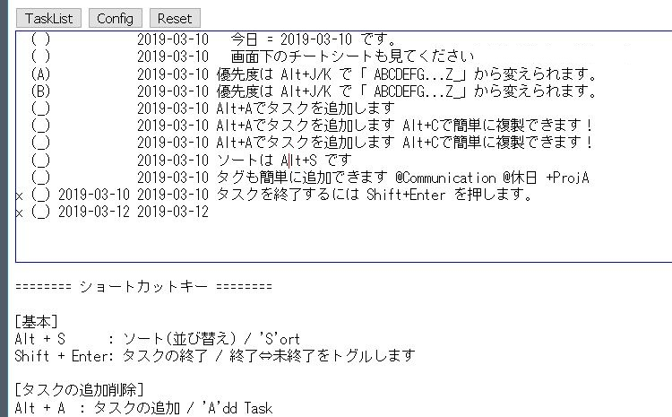
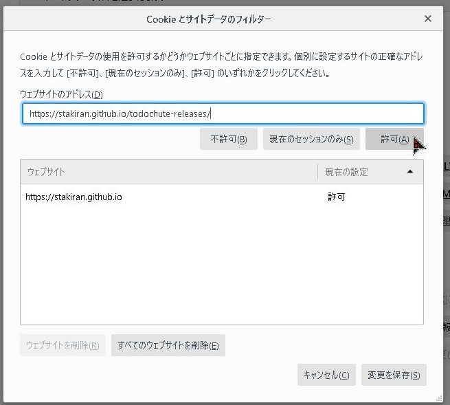

# todochute
Todo.txt と TaskChute を足して二で割ったようなタスク管理ツール。

## 概要

### 3 行で全般情報を
- テキストベースのシンプルなタスク管理ツールです
- ブラウザから使います
- 無料で使えます、登録も要りません、動作も軽いです

### 5 行でイメージを
- 一行一タスクで記述します
- Alt+A でタスク追加、Shift+Enter でタスク終了、その他優先度やタグを付けることができます
- Alt+S でソートを行います。良い感じに並んでくれるので並び順に悩む必要はありません
- データはローカルストレージに保存されます
- 詳しいショートカットキーはツール画面下部のヘルプテキストをご覧ください

### 2 行で元ネタを
- タスクのフォーマットは todo.txt を元にしています
- ソートして並べるアイデアは TaskChute を元にしています

## リリース
以下リンクからアクセスして使うことができます。

- 2019/03/21 [v0.3.0](tool/v0.3.0/index.html)
  - タスク削除に関するショートカットキーを拡充させました(Shftt + Delete/Backspace)
- 2019/03/14 [v0.2.0](tool/v0.2.0/index.html)
  - コンテキストタグとプロジェクトタグを追加できるようにしました
  - **v0.1.0以前からバージョンアップする場合、いったん Reset を行わないと動作しません**
    - 詳しくは [こちら](notice_about_verup.md)
- 2019/03/12 [v0.1.0](tool/v0.1.0/index.html)
  - ヘルプテキストと設定画面の拡充を行いました
- 2019/03/10 [v0.0.1](tool/v0.0.1/index.html)
  - 初版です
- [更新履歴](tool/changelog.md)

## 動作環境
以下環境で動作確認しています。

- Windows 7 + Firefox v65
- Windows 10 + Firefox v65

以下環境でもたぶん動くと思います（簡単に確認しました）。

- MacOS 10.14(Mojave) + Firefox v65
- Google Chrome

以下環境では動作しません。

- Internet Explorer 11
- Safari

他の OS やブラウザで動くかどうかはわかりません。

## データの保存について
todochute では **データの保存にローカルストレージを使用しています**。

ローカルストレージとは、あなたが使っているブラウザが持つローカル領域です。最近のブラウザはもれなく対応しています。todochute は、このブラウザの機能ゆえに、バックエンドサーバーや会員登録などを介さずともデータの保存を実現できています。

いくつか性質を挙げておきます。

- ブラウザの設定で Cookie を有効にしないと保存されません
- ブラウザが変わると、データは継承されません
  - あなたは PC 1 のブラウザ A で todochute を使います
  - この時、PC 1 のブラウザ A にデータが保存されています
  - したがって他の PC やブラウザを使うと、データは継承されません

またバックアップ等のシステムもありませんので、**大事なデータを扱う場合は念の為こまめにバックアップするようお願いいたします**。

### 必要な許可設定(Firefox で todochute のみ例外的に許可する)
普段 Cookie を無効にされている方は、Firefox v65 の場合、例外的に本サイトを許可対象にすることで保存できるようになります。

設定 > プライバシーとセキュリティ > Cookie とサイトデータ > サイトの設定を管理より `https://stakiran.github.io/todochute-releases/` を追加して許可してください。

詳細: [Cookie を有効または無効にする - Firefox ヘルプ](https://support.mozilla.org/ja/kb/enable-and-disable-cookies-website-preferences)

## 注意事項
- 本サービスの内容に基づく運用結果について、作者は一切の責任を負いかねますので、ご了承ください。

## 参考
Todo.txt:

- [Todo.txt: Future-proof task tracking in a file you control](http://todotxt.org/)
- [タスク管理メソッド todo.txt が面白そう - Qiita](https://qiita.com/sta/items/0f72c9c956cf05df8141)

TaskChute2:

- [タスク管理ツール・TaskChute2](https://cyblog.biz/pro/taskchute2/index2.php)
- [TaskChute スタートアップガイド.pdf](https://cyblog.biz/file/TC2StartupGuide.pdf)

## 作者
[stakiran](https://stakiran.github.io/stakiran/)
